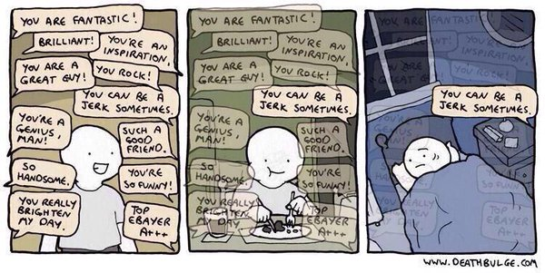

# How to Teach Programming

Notes from **How to Teach Programming (And Other Things)** by Greg Wilson

### Preparation

Pause for a moment to think about the most influential teacher you've had. What made them different? What was it about their class or style that impacted you so much? 

## Helping Novices Build Mental Models

### Who are your learners?

Stages of cognitive development: 

1. **Novice:** Someone who doesn't know what they don't know
2. **Competent Practitioner:** Able to handle normal tasks with normal effort under normal conditions
3. **Expert:** Able to easily handle situations that are out of the ordinary

One challenge in building a mental model for novices is to clear away things that *don't* belong. 

> It ain't what you don't know that gets you into trouble. It's what you know for sure that just ain't so. 
> **Mark Twain**

### Assessments

#### Formative Assessments

Takes place during a lesson while an instructor is teaching. Tells the instructor and learner how the learner is doing and allows the instructor to shape the lesson and what to focus on next.

A good formative assessment requires people to think through a problem.

#### Summative Assessments

Takes place at the end of the lesson to tell whether the desired learning took place and whether the learner is ready to move on.

> When the cook tastes the soup, that's formative. When the guests taste the soup, that's summative. 
> **Debra Dirkson**

## Teaching as a Performance Art

**Lateral Knowledge Transfer**: Setting out to teach X, but while watching an audience also learns Y as well. For example, while live coding students might be learning about conditionals, but also learns shortcuts or how to include multiple files together. 

### Feedback

#### Giving feedback

1. Balance positive and negative feedback (e.g. compliment sandwich)
2. Organize feedback using a rubric. Most people are more comfortable giving and receiving feedback when they feel that they understand the social rules governing what they are allowed to say and how they're allowed to say it.

#### Asking for feedback

Don't generalize, give direction and more specifics for others in order to receive more useful feedback. 

For instance, instead of asking "*What do you think?*", ask:

* What is one thing I could have done to make this lesson more effective? 
* If you could pick one thing from the lesson to go over again, what would it be?

## Expertise and Memory

### Traits of an expert: 

- Can jump directly from problem to solution because of a direct link. Competent practiioners would have to reason A, B, C, D, E while an expert can go from A to E in a single step, sometimes referred to as *intuition*. The downside though is that when asked to provide reasoning for their solution they often can't, they didn't reason to get to that solution - they just recognized it. 
- Often so familiar with subject that they can't imagine what it's like to not see the world that way. Can make them disconnected and have a harder time teaching a subject because of it. 
- Often better at diagnosis than competent practitioners due to more linkages between facts that makes it easier to reason backward from symptoms to causes.

### Repetition vs Deliberate Practice

Idea of 10,000 hours of practice will make someone an expert is quoted but reality is more complex. Doing the exact same thing over and over again is more likely to solidify bad habits. What works better is *deliberate practice*, which is doing something similar but subtly different, paying attention to what works and what doesn't work, then changing behavior in response to that feedback to get cumulatively better. 

### Seven Plus or Minus Two

Human memory can be divided into two distinct layers, short and long-term memory.

#### Short-term memory

Much faster than long-term memory to access but also smaller. Estimated that people can hold 7 plus/minus 2 items for a few seconds before things start to drop out.

#### Long-term memory

Persistent, theoretically impossible to fill in our lifetime, slow to access. You can't push information directly into a learner's long term memory. Instead, whatever is learned is held in short-term memory and only transferred to long-term memory after it has been held there and rehearsed. If we present too much information too quickly, the new will displace the old before it has had a chance to consolidate into long-term memory. 

#### Chunking

Our minds can store larger numbers of facts in short-term memory by creating chunks. For example, most of us will remember a word we read as a single item, rather than as a sequence of letters. 

## Cognitive Load

